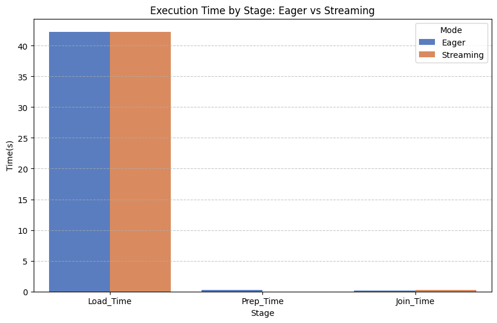
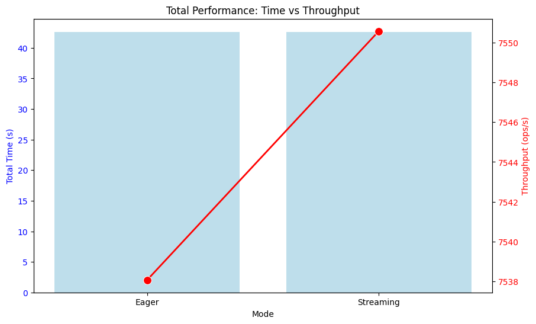
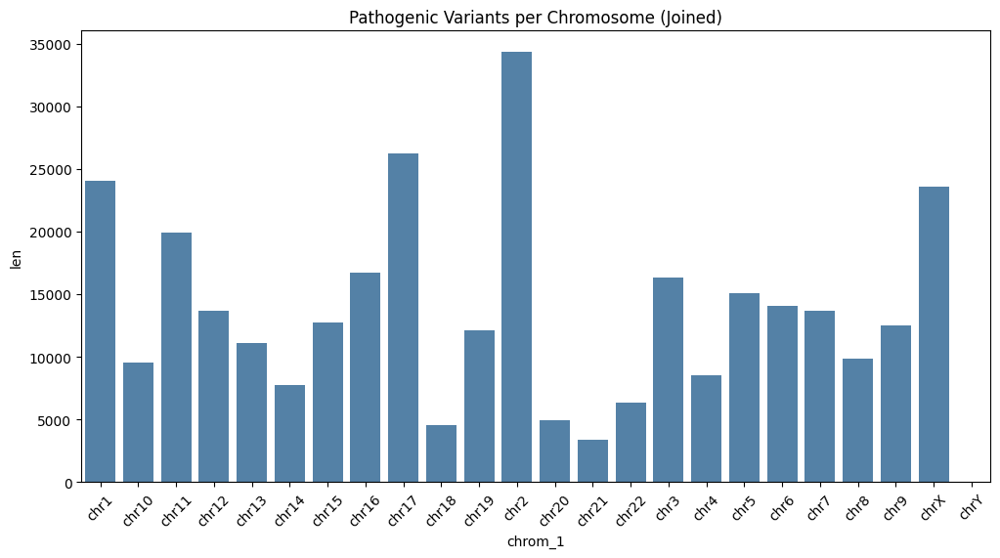
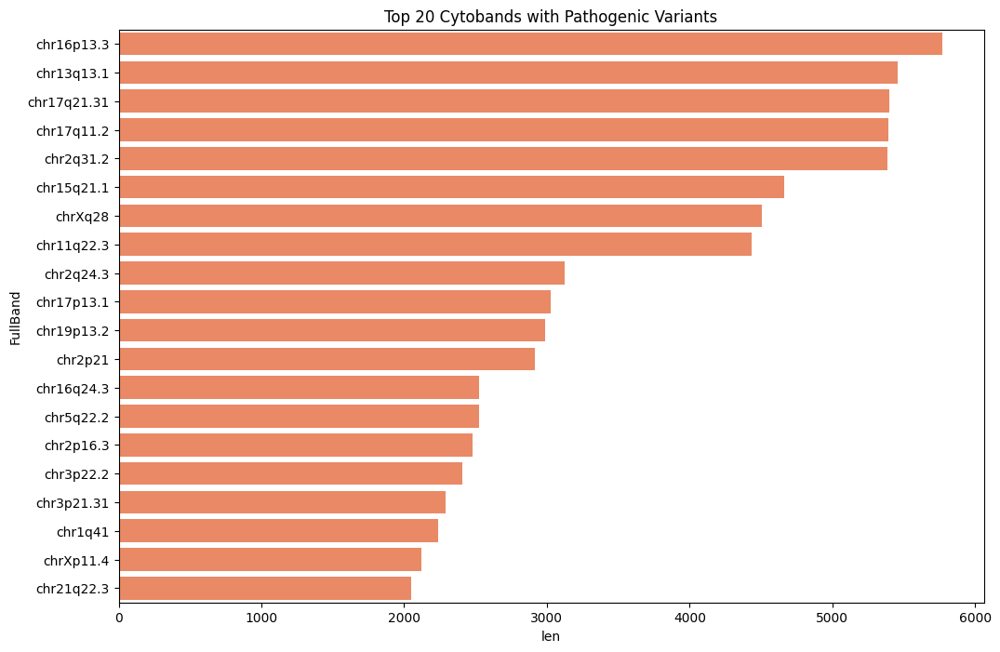

# Polars-Bio Performance & Analysis Report

**Date:** 2026-01-17 14:34:03

## 1. Executive Summary
Comparison of **Eager** vs **Streaming** execution modes for processing ClinVar VCF (4276954 rows).
## 2. Performance Benchmark
### Metrics Comparison
| Mode | Load_Time | Prep_Time | Join_Time | Total_Time | Throughput (ops/s) |
| --- | --- | --- | --- | --- | --- |
| Eager | 42.2204 | 0.2518 | 0.1551 | 42.6274 | 7538.0672 |
| Streaming | 42.2866 | 0.0008 | 0.2695 | 42.5568 | 7550.5690 |

### Execution Time by Stage

### Throughput Efficiency

## 3. Genomic Analysis (Pathogenic Variants)
- **Total Overlapping Variants:** 321,328

### Distribution by Chromosome

### Top Cytobands

## 4. Conclusions
- **Streaming** mode was faster by 0.07 seconds.
- Streaming mode reduces memory pressure for large VCFs.
