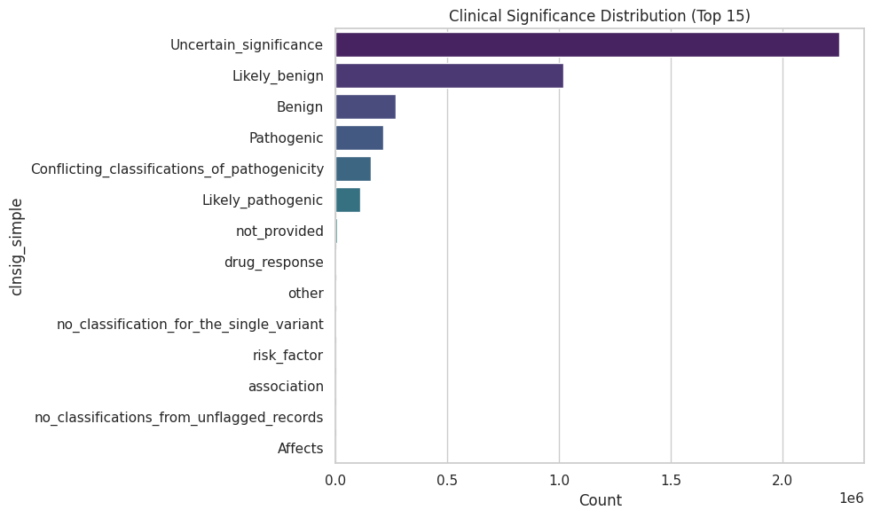

# ClinVar VCF Analysis Report

**Date:** 2026-01-17 14:23:21

## 1. Dataset Overview
- **Total Variants in VCF:** 4,276,954
- **Pathogenic Variants:** 321,506
- **Joined with Cytobands:** 321,328

## 2. Clinical Significance Distribution (Top 15)

| Clinical Significance | Count |
| :--- | :--- |
| Uncertain_significance | 2,253,051 |
| Likely_benign | 1,018,415 |
| Benign | 269,717 |
| None | 243,980 |
| Pathogenic | 212,903 |
| Conflicting_classifications_of_pathogenicity | 158,028 |
| Likely_pathogenic | 108,603 |
| not_provided | 6,907 |
| drug_response | 1,885 |
| other | 1,537 |
| no_classification_for_the_single_variant | 665 |
| risk_factor | 363 |
| association | 335 |
| no_classifications_from_unflagged_records | 245 |
| Affects | 129 |

## 3. Top 20 Cytobands with Pathogenic Variants
*> Based on interval overlap with UCSC Cytobands*

| Rank | Chromosome | Band | Full Name | Pathogenic Variant Count |
| :--- | :--- | :--- | :--- | :--- |
| 1 | chr16 | p13.3 | chr16p13.3 | 5,772 |
| 2 | chr13 | q13.1 | chr13q13.1 | 5,459 |
| 3 | chr17 | q21.31 | chr17q21.31 | 5,401 |
| 4 | chr17 | q11.2 | chr17q11.2 | 5,390 |
| 5 | chr2 | q31.2 | chr2q31.2 | 5,388 |
| 6 | chr15 | q21.1 | chr15q21.1 | 4,661 |
| 7 | chrX | q28 | chrXq28 | 4,503 |
| 8 | chr11 | q22.3 | chr11q22.3 | 4,436 |
| 9 | chr2 | q24.3 | chr2q24.3 | 3,125 |
| 10 | chr17 | p13.1 | chr17p13.1 | 3,028 |
| 11 | chr19 | p13.2 | chr19p13.2 | 2,990 |
| 12 | chr2 | p21 | chr2p21 | 2,913 |
| 13 | chr16 | q24.3 | chr16q24.3 | 2,527 |
| 14 | chr5 | q22.2 | chr5q22.2 | 2,525 |
| 15 | chr2 | p16.3 | chr2p16.3 | 2,478 |
| 16 | chr3 | p22.2 | chr3p22.2 | 2,406 |
| 17 | chr3 | p21.31 | chr3p21.31 | 2,291 |
| 18 | chr1 | q41 | chr1q41 | 2,236 |
| 19 | chrX | p11.4 | chrXp11.4 | 2,119 |
| 20 | chr21 | q22.3 | chr21q22.3 | 2,049 |

---
*Note: For interactive visualizations, download `clinvar_analysis.html`.*