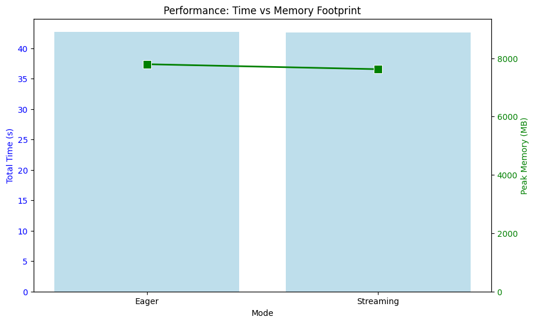

# Polars-Bio Performance & Capabilities Report

**Date:** 2026-01-17 14:58:38

## 1. Executive Summary
This report evaluates the **polars-bio-agent-skill** on the ClinVar dataset.
It includes a performance benchmark of execution modes and demonstrates key utility features.

## 2. Performance Benchmark (Eager vs Streaming)
### Metrics Comparison
| Mode | Load_Time | Prep_Time | Join_Time | Total_Time | Result_Rows | Memory_Peak_MB |
| --- | --- | --- | --- | --- | --- | --- |
| Eager | 42.43 | 0.27 | 0.18 | 42.88 | 321328 | 7798.44 |
| Streaming | 0.02 | 0.00 | 42.37 | 42.39 | 321328 | 5155.32 |

### Memory Footprint Analysis

## 3. Utility Capabilities Demonstration
The skill includes specialized tools for common genomic tasks. Below are the execution results:

### A. High-Performance Parquet Conversion
Converted polars-bio-agent-skill/data/clinvar.vcf.gz to optimal Parquet format.

| Metric | Value |
| :--- | :--- |
| Time (s) | 46.30 |
| Rows | 4276954 |
| Size (MB) | 168.28 |
| Compression Ratio | 1.05 |

### B. FASTA Sequence Analysis
Analyzed polars-bio-agent-skill/data/chr22.fa.gz (GC Content calculation).

| Metric | Value |
| :--- | :--- |
| Time (s) | 0.43 |
| Total Sequence Length (bp) | 50818468 |
| Average GC Content | 0.36 |

### C. Large-Scale Variant Annotation
Annotated ClinVar with mock gnomAD allele frequencies.

| Metric | Value |
| :--- | :--- |
| Time (s) | 41.24 |
| Total Variants | 4,276,954 |
| Annotated Variants | 50,000 |
| Annotation Rate | 1.17% |

## 4. Genomic Analysis (Pathogenic Variants)
- **Total Overlapping Variants:** 321,328

### Distribution by Chromosome

### Top Cytobands

